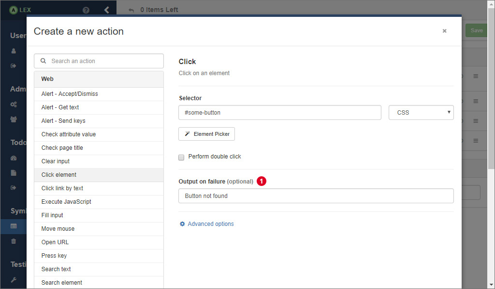

# Actions

The function of a symbol is defined by its actions and their execution order. 
An action can be understood as an atomic interaction with a system, like clicking on a button, submitting a form, making an HTTP request to a REST API and so on.

Each action can be marked with three different flags which are

| Flag          | Description                                                                                           |
|---------------|-------------------------------------------------------------------------------------------------------|
| negated       | Negates the outcome of an action.                                                                     |
| ignoreFailure | If this flag is set to "true" proceedings actions are executed although the action failed.            |
| disabled      | If this flag is set to "true" its execution is skipped during the call of its symbol.                 |

Normally, the output of a system is either *"Ok"* or *"Failed"* depending on success of the execution of the symbol.
If this is not expressive enough, you can also specify a custom failure output of each action that is propagated to the symbol.
Insert the custom output in 1 (image above).
In this field, dynamic values can be inserted as well (see section about variables and counters below).

## Web Actions

Web actions are used to interact with a browser interface like a normal user would. 
They are based on Selenium and ALEX offers a subset of the Selenium functionality that are presented in the table below.

| Name                   | Description                                                                  |
|------------------------|------------------------------------------------------------------------------|
| Alert - Accept/Dismiss | Accepts or dismisses an alert dialog.                                        |
| Alert - Get Text       | Save the displayed text of an alert/confirm/prompt window in a variable.     |
| Alert - Send keys      | Send user input to a prompt alert.                                           |
| Check Attribute        | Checks the value of an attribute of an element                               |
| Check Node             | Check if a certain element is present on the website.                        |
| Check Text             | Check if a certain text is part of the website body.                         |
| Check Title            | Checks if the page title is a certain string.                                |
| Clear                  | Clear an input field.                                                        |
| Click                  | Click or double click on an element.                                         |
| Click Link By Text     | Click on a link with a specific text value.                                  |
| Execute JavaScript     | Execute a JavaScript snipped in the page.                                    |
| Fill                   | Clear and fill an input field with some text.                                |
| Open URL               | Request a specific site.                                                     |
| Move Mouse             | Move the cursor to a specific element or coordinates                         |
| Press Key              | Press a special key on the keyboard                                          |
| Submit                 | Submit a form.                                                               |
| Select                 | Select an option form an select input field.                                 |
| Switch to              | Switch back to the parent content or the default content from another frame. |
| Switch to Frame        | Switch the Selenium context to another frame.                                |
| Wait for Attribute     | Wait until an attribute of an element has or contains a specific value.      |
| Wait for Text          | Wait until a specific text is visible on the website.                        |
| Wait for Title         | Wait until the title of a page changes.                                      |
| Wait for Node          | Wait until the state of an element changes.                                  |

More detailed information about the parameters of each web action is omitted here, since the forms in the frontend should be labeled sufficiently.

If you play around a little with the action editor, you may realize that most web actions require you to enter a CSS or an XPath expression to an element. 
This may be not that easy to find out in case you are not very familiar with HTML, CSS or XPath. 
So, there is a button that is labeled with *"Element Picker"*. 
This is a special feature of ALEX for extracting selectors elements from your website directly without having to know HTML.
Visit [this section](element-picker.md) to see how the use the element picker.

## REST Actions

REST actions are the counterpart to web actions. They are used to communicate with REST APIs. 
The table below shows a list of available actions.

| Name                   | Description                                                     |
|------------------------|-----------------------------------------------------------------|
| Check Attribute        | Check if the response has an specific attribute.                |
| Check Attribute Type   | Check if an attribute in the response has a specific type.      |
| Check Attribute Value  | Check if an attribute in the response has a specific value.     |
| Check Header Field     | Check if the response has a certain header field.               |
| Check Status           | Check if a previous response returned the expected HTTP status. |
| Make Request           | Makes an HTTP request                                           |
| Search in Body         | Search for a piece of text in the HTTP response body.           |
| Validate JSON          | Validate the body of a response against a JSON schema.          |

Keep in mind that working with HTTP requests and responses follows a certain pattern. 
Normally, you make a request and analyze the results. 
The order of your REST actions should also look like that. 
Start with a *Make Request* action and use other actions to work with the response.
The context of the *Make Request* action, namely the HTTP response, is passed to the following actions until the next *Make Request* action is made.

## General Actions

Actions of this group allow the interaction between different symbols and actions, for example by storing and passing String and Integer values to other actions.

| Name                           | Description                                                         |
|--------------------------------|---------------------------------------------------------------------|
| Assert Counter                 | Asserts the value of a counter.                                     |
| Assert Variable                | Asserts the value of a variable.                                    |
| Increment Counter              | Increment a counter by a given value.                               |
| Set Counter                    | Set a counter to a new value.                                       |
| Set Variable                   | Set a variable to a new value.                                      |
| Set Variable by Cookie         | Set a variable to the value of a cookie                             |
| Set Variable by HTML Element   | Set a variable to a value form a website element.                   |
| Set Variable by JSON Attribute | Set a variable to a value form a JSON response.                     |
| Set Variable by Node Attribute | Set a variable to the value of an attribute of an element.          |
| Set Variable by Node Count     | Set a variable to the number of elements matching a selector.       |
| Set Variable by Regex Group    | Set a variable to a group in a regex match.                         |
| Wait                           | Wait for a specific amount of time.                                 |

    The wait action can be useful for background tasks or AJAX calls, but should be used with caution because it can slow down the learn process.

## Variables, Counters and Files

Many web applications handle dynamic data and allow file uploads. 
In order to model and learn such behaviors and to pass data between symbols, actions and learn processes, *variables*, *counters* and *files* can be used.

<dl>
    <dt>Variables</dt>
    <dd>
        Variables contain (also empty) String values and are kept alive for a single membership query.
    </dd>
    <dt>Counters</dt>
    <dd>
        Counters are positive integer values that are persisted in the database per project. 
        They can be incremented and modified at will using corresponding actions. 
        Usually, they are used to create multiple objects of the same kind, e.g. user1, user2, ... and so on. 
        Further, counters can help to model a system reset and thereby allow a consecutive execution of multiple learn processes without having to manually reset the application in between every test.
    </dd>
    <dt>Files</dt>
    <dd>
        In order to learn websites that allow its users to upload files, this feature can be used as well.
        See <a href="file-upload">this page</a> for a more detailed description and their usage.
    </dd>
</dl>

In order to make use of those in actions, there is a small template language that has to be used in action fields:

| Notation                 | Description                                                           |
|--------------------------|-----------------------------------------------------------------------|
| \{\{#counterName\}\}     | The value of the counter with the name *counterName* is inserted      |
| \{\{\$variableName\}\}   | The value of the variable with the name *variableName* is inserted    |
| \{\{\\filename.ext\}\}   | The absolute path of the file *filename.ext* is inserted              |

The following example demonstrates the usage of variables.
The process can be transferred easily for counters and files.

Assume we have an application that manages todo items and the element with the selector `#new-todo` is the input field that allows a user to create a new item.
We now want to insert the content of the item dynamically via a variable.
First, create an action that sets the value of the variable.
As you can see in the picture above, there are some choices for how to do this.

Then, we create another action that inserts the value of the variable into the element `#new-todo`.
In the input field for the value, we use the notation from the table above to indicate that we want to insert the value of the variable *todoName*.

As soon as the action is executed, the value of *todoName* is inserted automatically. 
In the todo list, a todo with the text *"buy milk"* would appear in the application.