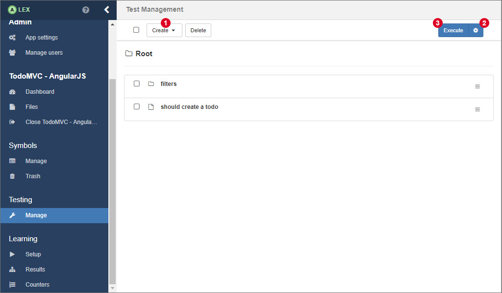
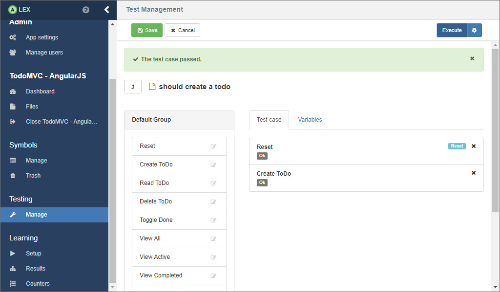
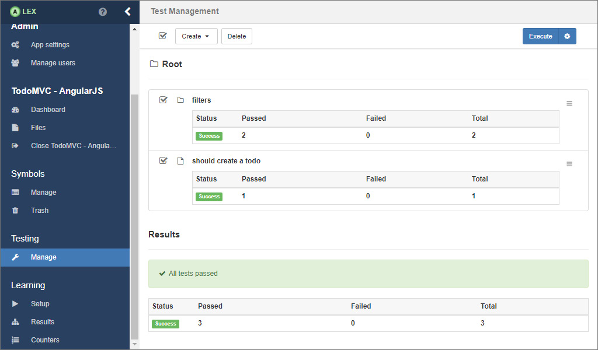

# Testing

ALEX has integration testing abilities on board. 
So, instead of learning, you can model and execute single test cases.
The corresponding functionality is available under the item **Manage** in the group **Testing**.

We differentiate between test cases and test suites.
A test case is a use case of the application and is modelled via a sequence of symbols.
A test suite bundles multiple test cases.
You can navigate through all test cases and test suites like in a typical directory structure.
Test cases are indicated by a file icon, test suites by a folder icon.

The option to create a test case or a test suite is available in the dropdown menu 1.
Clicking on a test case redirects you to a view where the test case can be modelled, see the picture below.

Here, you can create a sequence of symbols by clicking on the symbols that are displayed in their groups on the left.
Once you have created a test case, you can rearrange the symbols via drag and drop.
A click on the small button with the gear icon opens a modal window where you can configure the web driver you want to execute the test in.
Make sure you save any changes you have made before executing a test case.
You can execute the test case by clicking on the *Execute* button.
When the test case has been executed, a small notification appears telling if the execution succeeded or failed, like in the image below.
Furthermore, the output of every symbol is also displayed.

You can notice another tab on the page labeled *Variables*.
There, you can preconfigure variables that are used by the symbols in the test case, so that you do not have to create a reset symbol that sets them for each test case individually.

Clicking on 4 navigates you back to the parent test suite, like that one that is seen in the first picture.
The behavior here is analogue.
2 opens the modal window for configuring the web driver.
With 3 you execute all selected test cases and test suites.
The result of the execution is also displayed in a table for each test case / test suite and summarised for all executed tests, see below.

